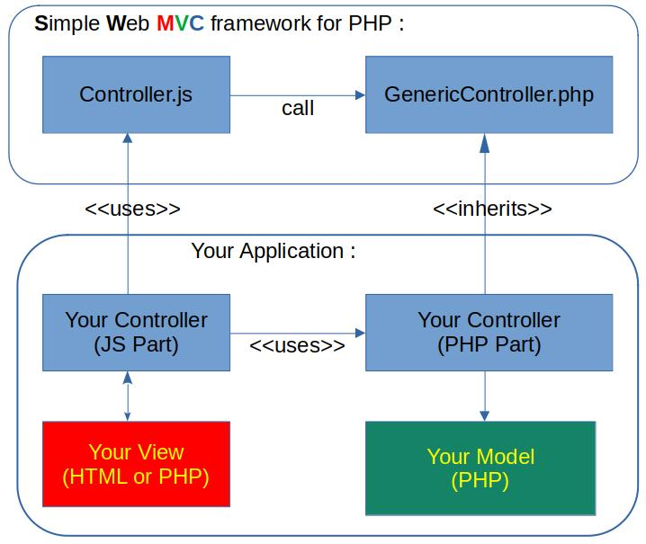

# SWMVC

a **S**imple **W**eb **MVC** Framework for PHP - **SWMVC**

# Description

This framework is a very simple application of the design pattern MVC (Model-View-Controller) for Web applications where the model part is written in PHP.

# Requirements

You need a web server with PHP enabled.
Just install in this server, the directory "swmvc"

# Example
There is a small example (folder 'tutorial) that illustrates the framework:

* *index.php* corresponds to the view
* *controller/myController.js* and *controller/MyController.php* correspond to the controller part
* *model/ModelPersons.php* represents the model that manages a json file *dataPersons.json*

**Important:** give the write access to the *dataPersons.json* file (chmod 777 dataPersons.json). 

Once the tutorial is deployed on your web server, just open the view *index.html*

# Licensing

The SWMVC framework software  is released under the GNU LGPL v3.0 or later.

#Author
 Olivier Caron, 2022

